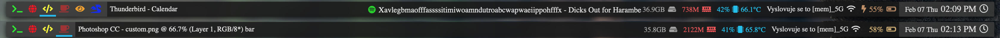

# Bar

Bar is an  [Übersicht](https://github.com/felixhageloh/uebersicht) widget
that places a customizable bar on your desktop.

This repository is a fork from [callahanrts' job](https://github.com/callahanrts/bar) updated to meet my needs.



## Elements

- Workspace {chunkwm needed} (TODO: make dynamic)
- Focused window {chunkwm needed}

- Currently playing music from
  - Spotify
  - Cmus

- Wi-Fi
- Battery + un/plugged symbol 
- Date/Time


## Installation

1. Download (or clone) this repository and place the folder in your Übersicht widgets directory.
2. Copy `script` folder to `~/scripts/uber/`

## Configuration

Open [index.jsx](https://github.com/samurajhais/bar/blob/master/index.coffee)
and edit as you'd like. Some of the objects toward the top should make
customization a little easier.

Elements itself are located in `elements` folder.

Scripts located in `script` folder are loaded from custom `~/scripts/uber/` folder. Read files very carefully if you are trying to rebuild this thing. Debug console is your best friend. 

## Space configuration
It's possible to get chunkwm to update when spaces are switched. You can
use the following in your `~/.khdrc`.
```
cmd - 1 : khd -p "cmd + alt - 1" && uberrefresh
...
```
`uberrefresh` is a shell script included in this repository. Copy it to
`/usr/local/bin`
```
cp bin/uberrefresh /usr/local/bin/uberrefresh
```

## Questions?

If you find a bug or have any questions about Bar, [submit an issue](https://github.com/samurajhais/bar/issues/new).

